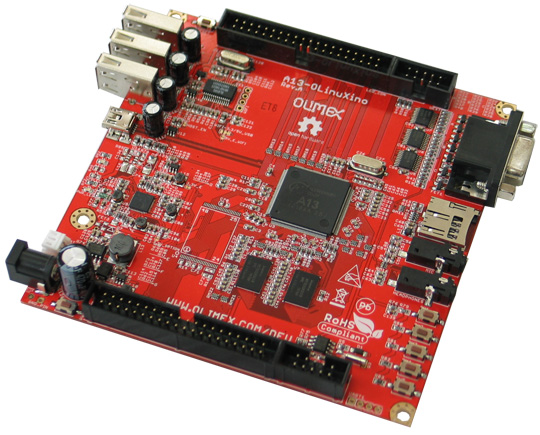
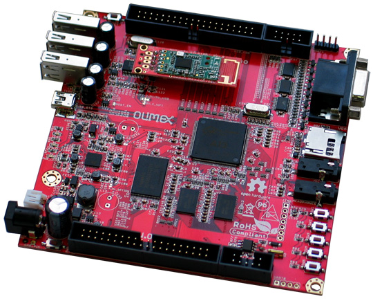

# A13-OLinuXino

OPEN SOURCE HARDWARE EMBEDDED ARM LINUX SINGLE BOARD COMPUTER WITH ALLWINNER A13 CORTEX-A8 @1000 MHZ

A13-OLinuXino is a low-cost single-board Linux computer in a compact nano-ITX form.
It uses the very first Cortex A8 processor available in the eLQFP176 package, produced by Allwinner Technology Inc A13.

A13-OLinuXino is produced in two versions.
A13-OLinuXino-WIFI has everything what A13-OLinuXino has, plus 4GB NAND Flash and USB-to-WIFI adapter which allows wireless connectivity.

## Features

- A13 Cortex A8 processor at 1GHz, 3D Mali400 GPU
- 512 MB RAM (2 x 256Mbit x 8)
- 4GB NAND Flash (for A13-OLinuXino-WIFI)
- 6-16VDC input power supply, noise immune design
- 3 + 1 USB hosts, 3 available for users, 1 leads to onboard pinout or to WIFI module (for A13-OLinuXino-WIFI)
- 1 USB OTG which can power the board
- SD-card connector for booting optional Linux images
- VGA video output
- Battery option and connector
- LCD signals available on connector so you still can use LCD if you disable VGA/HDMI
- Audio output
- Microphone input
- 4 Mount holes
- RTC PCF8563 on board for real time clock and alarms
- 5 Keys on board for android navigation
- [UEXT connector](https://www.olimex.com/Products/Modules/UEXT) for attaching expansion boards (sensors, relays, etc)
- GPIO connector with 68/74 pins and these signals:
  - 17 for adding NAND flash;
  - 22 for connecting LCDs;
  - 20+4 including 8 GPIOs which can be input, output, interrupt sources;
  - 3x I2C;
  - 2x UARTs;
  - SDIO2 for connecting SDcards and modules;
  - 5 system pins: +5V, +3.3V, GND, RESET, NMI
- Dimensions: (120x120)mm ~ (4.7"x4.7")

## [Hardware](hardware)

## Software

- [Linux Sunxi](http://linux-sunxi.org)
- [Image links, instructions, demo software, customer projects and more](https://www.olimex.com/wiki/A13-OLinuXino)

## Resources

- [User's manual](https://www.olimex.com/Products/OLinuXino/A13/A13-OLinuXino/resources/A13-OLINUXINO.pdf)
- [A13-processor brief and datasheet](https://www.olimex.com/Products/OLinuXino/A13/A13-OLinuXino/resources/A13-Brief.pdf)
- [Wiki](https://www.olimex.com/wiki/A13-OLinuXino)
- [Hardware fix for the first batch of DEV edition boards](https://www.olimex.com/Products/OLinuXino/A13/A13-OLinuXino-WIFI/resources/A13-OLinuXino-WIFI-DEV_fix.pdf)

## Community

- [OLinuXino forum](https://www.olimex.com/forum) for discussions and community support
- [Freenode #olimex irc channel](http://webchat.freenode.net/?channels=olimex) for OLinuXino development discussions

## FAQ

### What software is available for the board?

The software images that we provide and maintain are:

- Debian Linux for microSD card
- Android for microSD card
- Android for NAND memory (if your board has NAND)

The board is able to run a lot of other custom-made Linux distributions.
Please visit the WIKI and the GitHub pages of A13-OLinuXino to find latest images we officially provide and also links to 3rd party Linux images.

### There is no Android on the NAND memory! The boards with NAND used to have Android already loaded! What happened?

We no longer load Android on the NAND memory of the boards.
You can upload Android following the FAQ section of the wiki article of your board.

### I bought A13-LCDxx but when I connect it to the A13-OLinuXino I receive no image on the display. What do I do wrong?

The default A13-OLinuXino image is set for a VGA display and 800x600 resolution.
To use LCD with A13-OLinuXino you need to upload a new image with the appropriate settings.
The download links for the images may be found in the [wiki article for A13-OLinuXino](https://www.olimex.com/wiki/A13-OLinuXino)

### I bought A13-LCDxx and the SD card that has a Linux image written on it. However the resolution I see on my VGA/LCD is not correct. What am I missing?

You would need to change the configuration file in the main partition of the SD card.
Detailed information and download locations for the script files might be found [here](https://www.olimex.com/wiki/index.php?title=Configuration_of_hardware_in_the_debian_image).

### What is the operating temperature range of A13-OLinuXino?

The board works in the commercial temperature range 0C to 70C.

### How long this board will be available?

This board will be available forever!