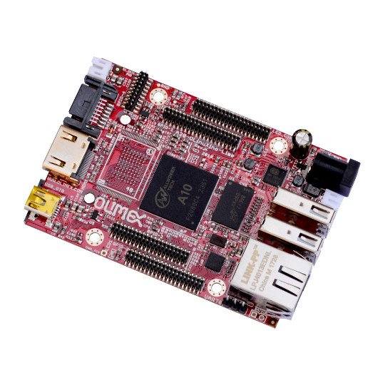

# A10-OLinuXino-LIME

OPEN SOURCE HARDWARE EMBEDDED ARM LINUX SINGLE BOARD COMPUTER WITH ALLWINNER A10 CORTEX-A8

A10-OLinuXino-LIME is a very compact Linux Open-source Hardware computer

## Hardware Notes

A20-OLinuXino-LIME AND A10-OLinuXino-LIME share the same hardware layout.

For the latest hardware revision, please visit the [A20-OLinuXino-LIME hardware section](../A20-OLinuXino-LIME).

The A10 and A20 chips are pin-to-pin compatible (drop-in replaceable).
Only the main chip placed is different.

## FEATURES

- Allwinner A10 Cortex-A8 processor typically running at 1GHz and Mali 400 GPU
- 512MB DDR3 RAM memory
- SATA connector with 5V SATA power jack
- Capable of HD (720p) video playback 
- HDMI connector
- 2 x USB High-speed host with power control and current limiter
- USB-OTG with power control and current limiter
- 100MBit native Ethernet
- LiPo Battery connector with battery-charging capabilities
- LCD row of pins (0.05'' step)
- 160 GPIOs on four GPIO rows of pins (0.05'' step)
- MicroSD card connector
- DEBUG-UART connector for console debug with USB-SERIAL-CABLE-F
- GPIO LED
- Battery charge status LED
- Power LED
- 2KB EEPROM for MAC address storage and more
- 3 BUTTONS with ANDROID functionality + RESET button
- 4 mount holes
- 5V input power supply, noise immune design
- PCB dimensions: 84x60 mm

## Documents

- [Users manual](doc/reference/A10-OLinuXino-LIME_manual.pdf)
- [Board dimensions](doc/reference/A10-LIME-dimensions.png)

## Hardware
- [Schematics and hardware source file](.)
- [Eagle shield template](A10-OLinuXino-Lime_Rev-B_SHIELD_TEMPLATE EAGLE)
- [KiCad shield template](A10_OLinuXino_Lime_Rev-B_SHIELD_TEMPLATE KiCAD)

## Software

Image links, instructions, demo software, customer projects and more might be found on the [wiki page](https://www.olimex.com/wiki/A10-OLinuXino-LIME).

## FAQ

### I am an inexperienced user and I'm afraid to mess up initially. What are the most common errors in the initial start-up of the board?

The best idea is to download the latest Debian or Android image from the wiki and to pay attention if it is for microSD card or the NAND memory.
After that ensure the image is properly written to the SD card or the NAND memory.
Finally, if you are expecting video output problems, ensure the image is set with the proper settings for the display/monitor you are going to use.
Double check if the power supply is sufficient (especially if powering a display from the board).

### What do I need to connect one of the Olimex-made displays to the board?

Refer to this [wiki article](https://www.olimex.com/wiki/How_to_connect_display_to_a_Lime_board).

### I bought A13-LCDxx but when I connect it to the A10-OLinuXino-LIME I receive no image on the display. What did I do wrong?

The default A10-OLinuXino-LIME Debian image is set for HDMI output and FullHD resolution.
To use LCD or lower the resolution you would need to start the shell script in the default Debian image.
More information might be found at the wiki article of the board.

### What is the operating temperature range of A10-OLinuXino-LIME?

The board works in the commercial temperature range 0C to 70C.

### How long this board will be available?

This board will be available [forever](https://olimex.wordpress.com/2014/11/27/how-long-olinuxino-with-allwinner-socs-will-be-produced-again-now-we-know-the-answer-forever)!