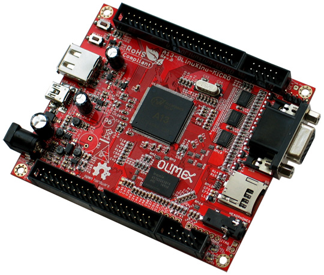

# A13-OLinuXino-MICRO

OPEN SOURCE HARDWARE EMBEDDED ARM LINUX SINGLE BOARD COMPUTER WITH ALLWINNER A13 CORTEX-A8 @1000 MHZ

A13-OLinuXino is a low-cost single-board Linux computer in a very compact form.
It uses the very first Cortex A8 processor available in the eLQFP176 package, produced by Allwinner Technology Inc A13.

## Features

- A13 Cortex A8 processor at 1GHz, 3D Mali400 GPU
- 256 MB RAM (128Mbit x 16)
- 5VDC input power supply with own ICs, noise immune design
- 1 USB host
- 1 USB OTG which can power the board
- SD-card connector for booting the Linux image
- VGA video output
- LCD signals available on connector so you still can use LCD if you disable VGA/HDMI
- Audio output
- Microphone input pads (no connector)
- 1 User key
- 4 Mount holes
- [UEXT connector](https://www.olimex.com/Products/Modules/UEXT) for connecting additional UEXT modules like Zigbee, Bluetooth, Relays, etc
- GPIO connector with 68/74 pins and these signals:
  - 17 for adding NAND flash;
  - 22 for connecting LCDs;
  - 20+4 including 8 GPIOs which can be input, output, interrupt sources;
  - 3x I2C;
  - 2x UARTs;
  - SDIO2 for connecting SDcards and modules;
  - 5 system pins: +5V, +3.3V, GND, RESET, NMI
- Dimensions: 100 x 85 mm (3.950x3.350'')
- Optional low-cost 7" LCD with touchscreen

## Documents

- [User's manual](doc/manuals/A13-OLINUXINO-MICRO.pdf)
- [A13-processor brief and datasheet](doc/A13-Brief.pdf)

## [Hardware](.)

## [Software](../../SOFTWARE/A13)

- [A1x Linux](http://linux-sunxi.org)
- [Image links, instructions, demo software, customer projects and more](https://www.olimex.com/wiki/A13-OLinuXino-MICRO)

## Community

- [OLinuXino forum](https://www.olimex.com/forum) for discussions and community support
- [Freenode #olimex irc channel](http://webchat.freenode.net/?channels=olimex) for OLinuXino development discussions

## FAQ

### There is only 1 USB host on the board. How can I connect my USB mouse and USB keyboard simultaneously?

You should use an external USB hub.

### What software is available for the board?

Many Linux distributions are working properly with the MICRO.
Please visit the WIKI and the git pages of A13-OLinuXino-MICRO to find latest images.
We officially support Debian for this board.

### I bought A13-LCD7-TS but when I connect it to the A13-OLinuXino-MICRO I receive no image on the display. What did I do wrong?

The default A13-OLinuXino-MICRO image is set for a VGA display and 800x600 resolution.
To use LCD with A13-OLinuXino-MICRO you need to upload a new image with the appropriate settings.
The download links for the images may be found in the [wiki article for A13-OLinuXino-MICRO](https://www.olimex.com/wiki/A13-OLinuXino).

### I bought A13-LCD7-TS and the SD card that has a Linux image written on it. However the resolution I see on my VGA/LCD is not correct. What am I missing?

You would need to change the configuration file in the main partition of the SD card.
Detailed information and download locations for the script files can be found [here](https://www.olimex.com/wiki/index.php?title=Configuration_of_hardware_in_the_debian_image).

### What is the operating temperature range of A13-OLinuXino?

The board works in the commercial temperature range 0C to 70C.

### Where can I find the Android image for the A13-OLinuXino-MICRO?

At the moment we haven't tested Android booting from a SD card.
Android from a SD card is currently not officially supported.
However, note that there are people who are reporting success at getting it to run - head to the Olimex forums for more recent info.

### How long this board will be available?

This board will be available [forever](https://olimex.wordpress.com/2014/11/27/how-long-olinuxino-with-allwinner-socs-will-be-produced-again-now-we-know-the-answer-forever)!