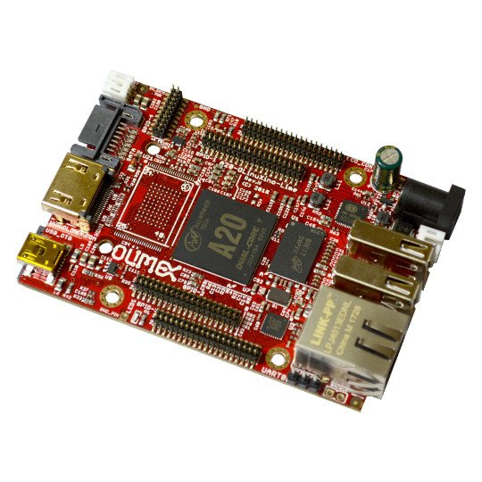

# A20-OLinuXino-LIME

OPEN SOURCE HARDWARE EMBEDDED ARM LINUX SINGLE BOARD COMPUTER WITH ALLWINNER A20 DUAL CORE CORTEX-A7

A20-OLinuXino-LIME is a compact (84x60)mm Linux open source hardware computer

# Features

- Allwinner A20 dual core Cortex-A7 processor, each core typically running at 1GHz and dual-core Mali 400 GPU
- 512MB DDR3 RAM memory
- NAND or eMMC Flash (for A20-OLinuXino-LIME-e/nXXGB)
- SATA connector with 5V SATA power jack
- Capable of FullHD (1080p) video playback
- HDMI connector
- 2 x USB High-speed host with power control and current limiter
- USB-OTG with power control and current limiter
- 100MBit native Ethernet
- LiPo Battery connector with battery-charging capabilities
- LCD connector compatible with with 4.3", 7.0", 10.1" LCD modules from Olimex
- 160 GPIOs on four GPIO connectors
- MicroSD card connector
- DEBUG-UART connector for console debug with USB-SERIAL-CABLE-F
- GPIO LED
- Battery charge status LED
- Power LED
- 2KB EEPROM for MAC address storage and more
- 3 BUTTONS with ANDROID functionality + RESET button
- 4 mount holes
- 5V input power supply, noise immune design
- PCB dimensions: 84 x 60 mm

# Documents

- [User's manual](doc/manuals/a20-olinuxino-lime-um.pdf)
- [Board's dimensions](https://www.olimex.com/Products/OLinuXino/A10/A10-OLinuXino-LIME-n4GB/resources/A10-LIME-dimensions.png)

# Hardware

- [Schematics and hardware source file](.)
- [Eagle shield template (same as for A10-OLinuXino-LIME)](../A10/A10-OLinuXino-LIME/A10-OLinuXino-Lime_Rev-B_SHIELD_TEMPLATE EAGLE)
- [KiCad shield template (same as for A10-OLinuXino-LIME)](../A10/A10-OLinuXino-LIME/A10_OLinuXino_Lime_Rev-B_SHIELD_TEMPLATE KiCAD)

# Software

- [FTP folder with latest official Linux images and torrents](ftp://staging.olimex.com/Allwinner_Images/A20-OLinuXino)
- [Wiki article with offical Linux image usage and build instructions](https://www.olimex.com/wiki/ArmbianHowTo)
- Image links, instructions, demo software, customer projects and more might be found at the [A20 wiki page](https://www.olimex.com/wiki/A20-OLinuXino-LIME)

# Notice

[Evaluation Board/Kit Important Notice](https://www.olimex.com/Products/Disclamer/evaluation-board-notice)

# FAQ

## I am an inexperienced user and I'm afraid to mess up initially. What are the most common errors in the initial start-up of the board?

The best idea is to download the latest Debian or Android image from the wiki and to pay attention if it is for microSD card or the NAND memory.
After that ensure the image is properly written to the SD card or the NAND memory.
Finally, if you are expecting video output problems, ensure the image is set with the proper settings for the display/monitor you are going to use.
Double check if the power supply is sufficient (especially if powering a display from the board).

## Can I use a Debian or Android image for A10-OLinuXino-LIME or A20-OLinuXino-LIME2?

No.
Both Debian and Android images are specfic for each board.
Make sure the image that you download and use is specifically marked as suitable for A20-OLinuXino-LIME.
The prepared cards which we sell for the board are also different.

## What do I need to connect one of the Olimex-made displays to the board?

At the moment you would need two 40 pin cables (named CABLE-40-40-10CM and CABLE-IDC40-15cm) and a small adapter board called A10-OLinuXino-LIME-UEXT.
In the future, a single cable will be avaialable.

## I bought a supported LCD display and the required cables but when I connect it to the A20-OLinuXino-LIME I receive no image on the display. What do I do wrong?

The default A20-OLinuXino-LIME Debian image is set for HDMI output and FullHD resolution.
To use LCD or lower the resolution you would need to start the shell script in the default Debian image.

## What is the operating temperature range of A20-OLinuXino-LIME?

The board works in the commercial temperature range 0C to +70C.

## How long this board will be available?

This board will be available [forever](https://olimex.wordpress.com/2014/11/27/how-long-olinuxino-with-allwinner-socs-will-be-produced-again-now-we-know-the-answer-forever)!