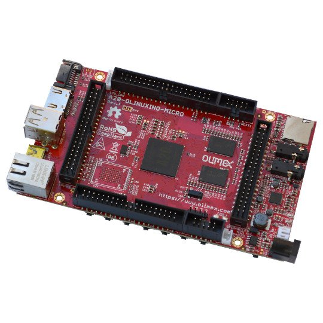

# A20-OLinuXino-MICRO

OPEN SOURCE HARDWARE EMBEDDED ARM LINUX SINGLE BOARD COMPUTER WITH DUAL CORE, DUAL GPU ALLWINNER A20 CORTEX-A7

Linux-enabled Allwinner A20 development board with Ethernet, HDMI output, 1GB DDR3 RAM memory, two SD card connectors, plenty of free GPIOs and much more.

Open source hardware and open source software A20 Linux board with 0.1" step connectors for easier access and evaluation.

We offer several variants of this board.
Aside from the base version we offer a variant with extra eMMC or NAND flash memory (suffix -e4GB, -e16GB, or -n8GB);
we have a variant with 16MB SPI flash memory (suffix -s16MB).
We also have variants of the board suitable for industrial temperature range of operation (-40+85)C.
These come with the "T2" chip and have "-IND" suffix in the name.

T2 is pin-to-pin compatible SOC from Allwinner designed for automotive applications.
T2 features a wider operating temperature range: -40C to 85C.
T2-OLinuXino-MICRO versions of the board have all components selected for industrial temperature range operation (-40+85C), including the SoC, the DDR3 memory, and the Ethernet controller.

# Features

- Allwinner A20 (T2) dual core Cortex-A7 processor, each core typically running at 1GHz and dual-core Mali 400 GPU; capable of FullHD (1080p) video playback 
- 1GB DDR3 RAM memory
- 8GB NAND flash memory option (in A20-OLinuXino-MICRO-n8GB)
- 4GB eMMC flash memory option (in A20-OLinuXino-MICRO-e4GB and T2-OLinuXino-MICRO-e4GB-IND)
- 2KB EEPROM for MAC address storage and more
- 100Mbit native Ethernet with controller and connector
- Battery connector with battery-charging capabilities
- SATA connector with 5V SATA power jack
- HDMI connector
- 2 x USB High-speed host with power control and current limiter
- USB-OTG with power control and current limiter
- VGA output on 6-pin 1.25mm (0.05") step connector
- Audio headphones output
- Microphone input on connector
- 2 x UEXT connectors
- LCD connector compatible with with 4.3", 7.0", 10.1" LCD modules from Olimex
- 160 GPIOs on three GPIO connectors
- MicroSD card connector
- SD/MMC card connector
- DEBUG-UART connector for console debug with USB-SERIAL-CABLE-F
- GPIO LED
- Battery charge status LED
- Power LED
- 10 BUTTONS with ANDROID functionality + RESET button
- 4 mount holes
- 6-16VDC input power supply, noise immune design up to Rev.I
- 8-24VDC input power supply, noise immune design Rev.J or later
- PCB dimensions: (5600 x 3250) mils ~ (142.24 x 82.55) mm
- Ambient temperature (0-70)°C for non industrial boards
- Ambient temperature (-45+85)°C for *-IND boards

# Documents

- [User's manual](doc/manuals/A20-OLinuXino-Micro.pdf)
- [A20 official web page](http://www.allwinnertech.com/index.php?c=product&a=index&id=45)

# Hardware

- [OLINUXINO project location - source files, documentation, examples](.)

# Software

- [FTP folder with latest official Linux images and torrents](ftp://staging.olimex.com/Allwinner_Images/A20-OLinuXino)
- [A20 wiki article](https://www.olimex.com/wiki/A20-OLinuXino-MICRO) - image links, instructions, demo software, customer projects and more might be found at the wiki page

# Notice

- [Evaluation Board/Kit Important Notice](https://www.olimex.com/Products/Disclamer/evaluation-board-notice)

# FAQ

## I am an inexperienced user and I'm afraid to mess up initially. What are the most common errors in the initial start-up of the board?

The best idea is to download the latest Debian or Android image from the wiki and to pay attention if it is for microSD card or the NAND memory.
After that ensure the image is properly written to the SD card or the NAND memory.
Finally, if you are expecting video output problems, ensure the image is set with the proper settings for the display/monitor you are going to use.
Double check if the power supply is sufficient (especially if powering a display from the board).

## I purchased A20-OLinuXino-MICRO with extra flash memory and want to install Debian to the flash. Is this possible?

Yes.
Prepare a card with the official Debian image and run the install shell script.
Make sure to use the image suitable for your type of flash memory, either NAND or eMMC.
There are separate images and separate .sh install scripts for NAND and eMMC.
Make sure to use the correct one.

## I can't find Android image with VGA output. Please send me an image with the correct configuration settings.

We couldn't compile Anroid image with proper VGA output despite our numerous attempts.
Please note that: **we neither have nor provide an Android image for a VGA monitor.**
There is a tested and working Debian image for VGA monitor.

## I connect this fine cable to the A20 board and then the cable to my VGA-compatible TV set, then I power the board and a LED turns on but there is no output on the TV. Where I did wrong?

You need to download the default Debian Linux image and use the script to change the default video output configuration.
More information on how-to do it might be found at the [wiki article](https://www.olimex.com/wiki/A20-OLinuXino-MICRO).

## How long this board will be available?

This board will be available [forever](https://olimex.wordpress.com/2014/11/27/how-long-olinuxino-with-allwinner-socs-will-be-produced-again-now-we-know-the-answer-forever)!