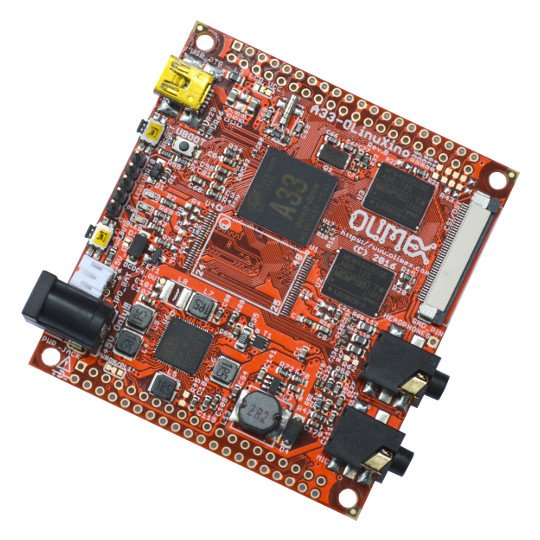

# A33-OLinuXino

A33-OLINUXINO QUAD CORE CORTEX-A7 1.2GHZ WITH 1GB RAM LINUX SINGLE BOARD COMPUTER

A33-OLinuXino is Open Source Hardware single board computer with A33 Quad core Cortex-A7 processor, Mali 400 GPU, OpenGL ES 2.0, RGB/LVDS, MIPI DSI interface for up to 1280x800 resolution displays, 5M/8M pixel CSI, HI-FI 100 dB Audio Codec.

# Features

- A33 Quad Core Cortex-A7 running at 1.2Ghz
- 1GB DDR3 RAM running at clock 432/360MHz
- USB On-The-Go interface on USB mini connector
- AXP223 PMU
- Debug UART connector
- LiPo battery charger
- Step-up converter allow all peripherals including USB hosts to work properly on Li-Po battery power
- Audio input for microphone
- Audio output for headphones
- Camera CSI / LCD MIPI  40 pin FPC connector
- LCD 0.1" step 40 pin connector (not assembled on board)
- GPIO 0.1" step 40 pin connector (not assembled on board)
- Barrel power jack for external 5V supply
- PCB dimensions: 66 x 71 mm

# Documents

- [A33 datasheet](doc/reference/A33-Datasheet-release-1.1.pdf)
- [A33 users manual](doc/reference/A33-user-manual-release-1.1.pdf)
- [A33-OLinuXino wiki article](https://www.olimex.com/wiki/A33-OLinuXino)

# Hardware

- [A33-OLinuXino latest schematic in PDF format](A33-OLinuXino_Rev_C.pdf)
- [A33-OLinuXino design CAD files](.)

# Software

- [FTP folder with latest official Linux images and torrents](ftp://staging.olimex.com/Allwinner_Images/A33-OLinuXino)
- [Wiki article with offical Linux image usage and build instructions](https://www.olimex.com/wiki/ArmbianHowTo)
- [Linux image](https://www.olimex.com/wiki/images/7/7d/A33_OLinuXino_allwinner_kernel_3.4.39_Jessie_rel_1.torrent) and [instructions](../../SOFTWARE/A33/A33-build-3-4-39-1/BUILD_DESCRIPTION_A33-OLinuXino_Allwinner_kernel_3.4.39_Jessie_rel_1.md) how to build
- [Android 4.4 image](https://www.olimex.com/wiki/images/5/5c/Sun8iw5p1_android_olinuxino-a33.torrent) - instructions how to download to the card - [build instructions](https://github.com/hehopmajieh/olinuxino_configs/tree/master/A33-OLinuXino)

# FAQ

## Can I have the LCD or/and the GPIO male or female connectors soldered?

Yes, this is possible for minimum order of 50 pcs. Contact us for quote.

## Can I use your LCD displays with this board?

Yes, but only the 4.3", 7", 10" displays.
The resistve touchscreens would not work since the A33 chip supports only capacitive touchscreens.

## Do you have a ready configuration for your displays?

Currently the official image has support only for 7 inch display is supported.