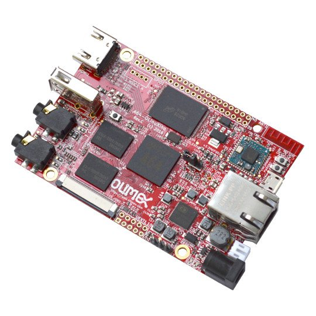

# A64-OLinuXino

A64-OLINUXINO QUAD CORE CORTEX-A53 ARM 64 BIT DEVELOPMENT BOARD

Open source hardware board that runs Linux and Android. Entirely designed with open source software CAD tools.

There are three models:

- **A64-OLinuXino-1G0G** with 1GB RAM but NO flash and NO WiFi/BLE connectivity
- **A64-OLinuXino-1G4GW** with 1GB RAM and 4GB extra flash and extra WiFi/BLE module
- **A64-OLinuXino-2G16G-IND** with 2GB RAM and 16GB extra flash but NO WiFi/BLE connectivity; with components that work in the industrial -40+85C temperature range

# Features

- Allwinner A64 - 1.2 GHz Quad-Core ARM Cortex-A53 64-bit
- Memory: 1GB or 2GB RAM DDR3L @ 672Mhz 
- 0/4/16GB eMMC flash memory for storage and boot
- MicroSD card connector for cards up to 32GB
- Debug: serial UART debug header with 0.1" pins
- Wired connectivity: 10/100/1000Mbps GbE Ethernet
- Wireless connectivity: popular on-board WIFI and bluetooth 4.0 BLE module with built-in antenna (only available in the A64-OLinuXino-1G4GW version)
- Monitor output: HDMI output
- Display output: LCD output on 40-pin ribbon cable connector and MIPI DSI with 20-pin ribbon connector
- Audio: headphone output and microphone input with phone jacks (can be changed to Line-in and Line-out via jumpers)
- External power: power jack for 5V exeternal power supply
- Battery power option and built-in charger circuit: the board can be fully powered via 3.7 Li-Po battery
- USB connectivity: USB-OTG support on microUSB connector; USB host on USB type A connector; USB HSIC signals available on 4-pin header drills @ 0.1" step
- LEDs: power indication LED, battery charging status LED, user-programmable LED
- GPIO expansion: provided 40-pin header drills @ 0.1" step with useful signals (like CSI camera interface and GPIOs)
- UEXT expansion: provided 10-pin header drills @ 0.1" step for UEXT expansion
- optional SPI Flash on SO8 connector
- RTC battery expansion: pad provided for powering the RTC of AXP803
- Buttons: UBOOT button; RESET button; POWER button
- Four mounting holes
- PCB dimensions: (90.0 x 62.5)mm ~ (3.5 x 2.5)"

# Documents

- [Quick start with A64-OLinuXino](PDF/A64-OLinuXino-quick-start.pdf)
- [A64-OLinuXino Rev.D schematic in PDF format](A64-OLinuXino_Rev_D_1G4GW.pdf)
- [General board dimensions](doc/images/A64-dimensions-BW.jpg)

# Hardware

- [GitHub repository with CAD files and BOM](.)

# Software

- [Torrent of latest official Ubuntu image, HDMI output set per default](https://www.olimex.com/wiki/images/4/43/A64olinuxino_ubuntu_16.04.3_20180523_rel5.torrent)
- Android images for microSD card: [HDMI video output](https://www.olimex.com/wiki/images/6/62/Android_a64-olinuxino-hdmi-4G.torrent) or [7 inch LCD output](https://www.olimex.com/wiki/images/5/56/Android_a64-olinuxino-lcd-4G.torrent)
---
- [How to build the official Linux image](https://github.com/hehopmajieh/olinuxino_configs/tree/master/A64-OLinuXino) and once done [how to prepare the card](software/A64-ubuntu_built_preliminary_rel_2/prepare_sd_card_rel_2.txt)
- [GPIO control Python module for the board available at PyPI](https://pypi.python.org/pypi/pyA64/0.1.0)
- [Servo module control library and example](https://github.com/d3v1c3nv11/a64servo)

# FAQ

## What LCDs can I connect to A64-OLinuXino?

You can connect LCD-OLinuXino-7 and LCD-OLinuXino-10 LCDs, however the A64 chip has no support for resistive touch panels so the touch screen will not be available.
The 7 and 10 inch LCDs with capacitive touch panels will be added soon to our product range.
To connect an LCD to A64-OLinuXino you need FPC-40-0.5-150 cable.

## How long this board will be available?

This board will be available [forever](https://olimex.wordpress.com/2014/11/27/how-long-olinuxino-with-allwinner-socs-will-be-produced-again-now-we-know-the-answer-forever)!