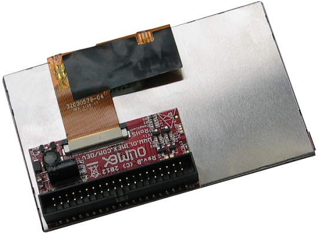

# A13-LCD43TS

4.3" LCD screen with backlight and resistive touch screen panel, compatible with A13-OLinuXino and iMX233-OLinuXino

This item is **OBSOLETE**.
Please use [LCD-OLinuXino-4.3TS](../LCD-OLinuXino-4.3TS).

# Overview

A 4.3" LCD display with touch screen panel, compatible with Olimex Allwinner and Olimex iMX233 development boards and suitable for GNU/Linux video output.

# TFT Panel Features

- Construction: 4.3” a-Si color TFT-LCD, White LED / CCFL Backlight and PCB.
- Resolution (pixel): 480(R.G.B) X272
- Connector for touch screen
- Interface: 40 pin pitch 0.5 FFC
- Power supply voltage: 3.3V single power input. Built-in power supply circuit.
- Viewing Direction:6 o’clock (the wide angle makes it hard for the image to be discolored)

# Documents

- [Blog-post with some of the multitouch abilities of A13-LCD43TS](http://olimex.wordpress.com/2012/11/30/a13-lcd4-3ts-with-multitouch-feature)

# Hardware

- [Display, controller and panel datasheet](doc/datasheets/GFT043HA480272Y_rev_A.pdf)
- [Source files](.)
- [Olimex product page](https://www.olimex.com/Products/Retired/A13-LCD43TS/open-source-hardware)

# Software

- Please refer to the OLinuXino wiki articles which contain suitable Linux images for the 4.3" display.

# FAQ

### I bought A13-LCD4.3TS but there is no ready Android for it. Where can I find it?

The display is too small to be used with our latest Android releases.
Please either use Debian or get a 7" or 10" inch display.

### I bought A13-LCD4.3TS but when I connect it to the A13-OLinuXino I receive no image on the display. What do I do wrong?

The default A13-OLinuXino image is set for a VGA display and 800x600 resolution.
To use LCD with A13-OLinuXino you need to run a configuration script.
More information might be found [here](https://www.olimex.com/wiki/A13-OLinuXino). 

### I bought A13-LCD4.3TS and the SD card that has Linux image written on it. However the resolution I see on my VGA/LCD is not correct. What am I missing?

You would need to run a configuration script as explained in the wiki article for the respective board.
