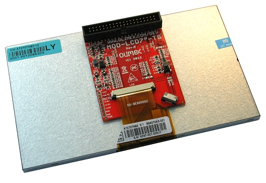

# A13-LCD7-TS

7-INCH LCD DISPLAY WITH RESISTIVE TOUCH SCREEN PANEL SUITABLE FOR OLIMEX OLINUXINO BOARDS

**This item is OBSOLETE**

Please use [LCD-OLinuXino-7TS](../LCD-OLinuXino-7TS).

# Features

- Innolux 7'' (480x800) AT070TN9X display with backlight
- 16 700 000 colors
- Anti-glare surface
- Resistive touch-screen panel
- DC-DC for LCD backlight
- 40 pin connector for direct connection to A13-OLinuXino boards
- Testpads for easy diagnostic
- FR-4, 1.5 mm, red soldermask, component print
- Dimensions:165x100mm (6.5 x 3.95")

# Documents

- [Display datasheet](doc/datasheets/S700-AT070TN92.pdf)

# Hardware

- [A13-LCD7 schematic (rev.B)](A13-LCD7''_Rev_B_sch.pdf)
- [A13-LCD7 schematic Eagle sources](.)
- [Olimex product page](https://www.olimex.com/Products/Retired/A13-LCD7-TS/open-source-hardware)

# FAQ

## I bought A13-LCD7TS but when I connect it to the A20-OLinuXino I receive no image on the display. What do I do wrong?

The default A20-OLinuXino image is set for a HDMI display and 720p resolution.
To use LCD with A20-OLinuXino you need to set proper display settings.
Explanation of how to do it via the default script might be found in the [wiki article for A20-OLinuXino](https://www.olimex.com/wiki/A20-OLinuXino-MICRO).

## I bought A13-LCD7TS and the SD card that has Linux image written on it. However the resolution I see on my VGA/LCD is not correct. What am I missing?

You would need to change the configuration file via the ``./change_display*`` script.
Detailed information might be found at the wiki article of your OLinuXino board.