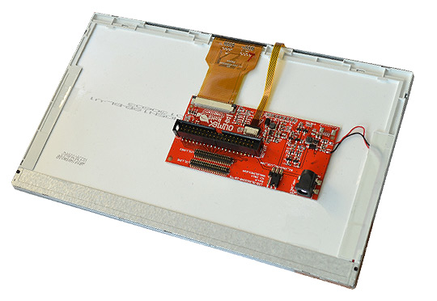

# LCD-OLinuXino-10

10-INCH LCD DISPLAY SUITABLE FOR OLIMEX ALLWINNER BOARDS

LCD-OLinuXino-10 is a 10" 1024x600 pixel LCD display, compatible with Olimex A10, A10s, A13, A20, and A64 Allwinner OLinuXino development boards which have either a 0.1" or 0.05" or ribbon LCD connector.
Suitable for Linux and Android video output.
It has a resistive touch panel, compatible with A10, A13, A10s, A20 boards.
Note that the A64 chip has no support for resistive touch panels.

# Features

- 10" WSVGA (V:1024 lines, H:600 pixels) display
- LED light-bar backlight system (9 parallel 3 serial)
- Resistive touch screen (only in LCD-OLinuXino-10TS)
- 16 200 000 colors
- Can be powered by the host board or externally
- DC-DC for LCD backlight
- 40 pin 0.1" and 0.05" connectors for direct connection to OLinuXino boards
- FR-4, 1.5 mm, red soldermask, component print
- Dimensions: (222 x 143)mm ~ (8.74 x 5.63)"
- **Note that the cable to connect to your board is sold separately**

# Documents

- [Display datasheet](doc/datasheets/F101TT50_1_release.pdf)
- [Display component change notice](doc/LCD-OLinuXino-10-errata.pdf)

# Hardware

- [LCD-OLinuXino-10 schematics in PDF format and Eagle sources](.)
- [Olimex product page](https://www.olimex.com/Products/OLinuXino/LCD/LCD-OLinuXino-10/open-source-hardware)

# FAQ

## Which boards can be used with LCD-OLinuXino-10?

OLinuXino boards that carry the OLinuXino or SOM name and have an LCD connector would work with the LCD-OLinuXino-10.
Unlike the previous iteration of displays, the LCD-OLinuXino-10 has both a 0.1" connector and a 0.05" connector on the rear panel.
This allows the easy connection of boards with large LCD connectors and also boards with small LCD connectors (such as the LIME boards).
You only need a single 40-40 cable with the same step on both sides to connect between the LCD and the board.
Please note that the ten inch display is not recommended for the A13 OLinuXino as the board may lack the required computing power (especially under Android).

## I bought LCD-OLinuXino-10 but when I connect it to the A20-OLinuXino I receive no image on the display. What do I do wrong?

The default A20-OLinuXino image is set for a HDMI display and 720p resolution.
To use LCD with A20-OLinuXino you need to set proper display settings.
Explanation of how to do it via the default script might be found in the [wiki article for A20-OLinuXino](https://www.olimex.com/wiki/A20-OLinuXino-MICRO)

## I bought LCD-OLinuXino-10 and the SD card that has Linux image written on it. However the resolution I see on my VGA/LCD is not correct. What am I missing?

You would need to change the configuration file via the ``./change_display*`` (press "TAB" to auto-complete) script.
Detailed information might be found at the wiki article of your OLinuXino board.