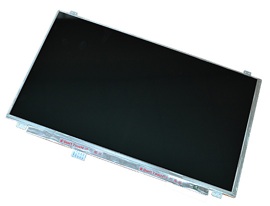

# LCD-OLinuXino-15.6

15.6 inch display without touchscreen

# Overview

An HD display compatible with A10 and A20 boards.
Due to its high power demand the display is provided with a separate 5V power jack.
Note that it would not work properly with A13 or A10s boards which lack the computational power required for a smooth operation.

# Features

- LCD display 1366x768 pixels
- 3.5W power consumption
- 15.6”(15.55”)
- HD 16:9 color TFT-LCD with LED backlight
- Works with the more powerful OLinuXino and SOM designs
- Two interface connectors: both 40 pin 0.1" pitch and 40 pin 0.05" pitch
- **Note that the cable to connect to your board and the additional power adapter are sold separately**

# Documents

- [Display datasheet](doc/datasheets/B156XW04V5.pdf)

# Hardware

- [Source files](.)
- [Olimex product page](https://www.olimex.com/Products/OLinuXino/LCD/LCD-OLinuXino-15.6/open-source-hardware)

# FAQ

### Which boards can be used with LCD-OLinuXino-15.6?

OLinuXino boards that carry the OLinuXino or SOM name and have an LCD connector would work with the LCD-OLinuXino-15.6.
Unlike the previous iteration of displays, the LCD-OLinuXino-15.6 has both 0.1" connector and 0.05" connector on its back.
This allows the easy connection of boards with big LCD connector and also of boards with small LCD connector (like the LIME boards).
You only need a single 40-40 cable with the same step on both sides to connect between the LCD and the board.
Please note that the 15.6 inch display is not recommended for boards with Allwinner A13 or A10s since the boards migth lack the required computing power for a smooth operation(especially under Android).

### I bought LCD-OLinuXino-15.6 but when I connect it to the A20-OLinuXino I receive no image on the display. What do I do wrong?

The default A20-OLinuXino image is set for a HDMI display and 720p resolution.
LCD-OLinuXino-15.6FHD has a native resolution of 1366 x 768 pixels.
To use LCD with A20-OLinuXino you need to set proper display settings.
Explanation of how to do it can be found at [this wiki article of the A20 board](https://www.olimex.com/wiki/A20-OLinuXino-MICRO#How_to_change_HDMI.2C_VGA_and_LCD_resolutions_in_the_official_Debian_image.3F).

### I bought LCD-OLinuXino-15.6 and the SD card that has Linux image written on it. However the resolution I see on my VGA/LCD is not correct. What am I missing?

You would need to change the video output setting using the shell script.
Type: ``./change_display`` and then press **Tab** to auto-complete, then press **Enter**.
Navigate to the LCD menu and select **1366 x 768**.
Reboot.
