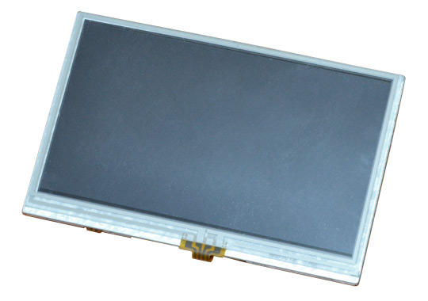

# LCD-OLinuXino-4.3TS

4.3 inch LCD screen with backlight and resistive touch screen panel, compatible with OLinuXino boards.

# Overview

A 4.3" LCD display with a resistive touch screen component, compatible with Olimex A10, A13, A10s, A20 Allwinner development boards with either 0.1" or 0.05" LCD connector.
Suitable for Linux and Android video output.

# TFT Panel Features

- Construction: 4.3" color TFT-LCD, White LED Backlight and PCB
- Resolution: 480x272 pixels
- Touch screen
- Two interface connectors: both 40 pin 0.1" pitch and 40 pin 0.05" pitch
- Power supply voltage: 5V external power jack or 40 pin LCD connector
- **Note that the cable to connect to your board is sold separately**

# Hardware

- [Source files](.)
- [Display, controller and panel datasheet](doc/datasheets/GFT043HA480272Y_rev_A.pdf)
- [Olimex product page](https://www.olimex.com/Products/OLinuXino/LCD/LCD-OLinuXino-4.3TS/open-source-hardware)

# Software

- Please refer to the OLinuXino wiki articles which contain suitable Linux images for the 4.3" display.

# FAQ

### I bought LCD-OLinuXino-4.3TS but there is no ready Android for it. Where can I find it?

The display is too small to be used with our latest Android releases.
Please either use Debian or get a 7" or 10" inch display.

### I bought LCD-OLinuXino-4.3TS but when I connect it to the A13-OLinuXino I receive no image on the display. What do I do wrong?

The default A13-OLinuXino image is set for a VGA display and 800x600 resolution.
To use LCD with A13-OLinuXino you need to run a configuration script.
More information might be found [here](https://www.olimex.com/wiki/A13-OLinuXino).

### I bought LCD-OLinuXino-4.3TS and the SD card that has Linux image written on it. However the resolution I see on my VGA/LCD is not correct. What am I missing?

You would need to run a configuration script as explained in the wiki article for the respective board.
