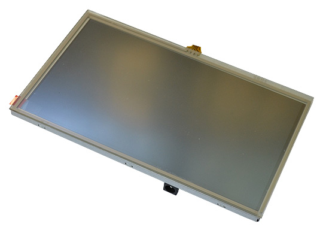

# LCD-OLinuXino-7

7-inch LCD display suitable for Olimex Allwinner boards

# Overview

A 7" LCD display, compatible with Olimex A10, A13, A10s, A20, A64 Allwinner development boards which have either 0.1" or 0.05" or ribbon LCD connector.
Suitable for Linux and Android video output.

LCD-OLinuXino-7 is a 480x800 pixel LCD display compatible with  A10, A13, A10s, A20, A33 and A64 OLinuXino boards.
LCD-OLinuXino-7TS has a resistive touch panel (compatible with A10, A13, A10s, A20 boards; not suitable for the A33 and A64 chips since they do not support for resistive touch panels).

# Features

- Innolux 7" (480x800) AT070TN9X display with LED backlight
- Resistive touch screen (only in LCD-OLinuXino-7TS)
- 16 700 000 colors
- Anti-glare surface
- Four interface connectors for different boards: 2 x 40-pin 0.1" pitch (for LIME and LIME2 layouts); 1 x 40-pin 0.05" pitch; 1 x ribbon 
- FR-4, 1.5 mm, red soldermask, component print
- Dimensions of the PCB: (165 x 100)mm ~ (6.5 x 3.95)"
- **Note that the cable to connect to your board is sold separately**

# Documents

- [Display datasheet](doc/datasheets/S700-AT070TN92.pdf)

# Hardware

- [LCD-OLinuXino-7 source files](Hardware revision C)
- [Olimex product page](https://www.olimex.com/Products/OLinuXino/LCD/LCD-OLinuXino-7/open-source-hardware)

# FAQ

### I bought I bought LCD7-OLinuXino-7 but when I connect it to the A20-OLinuXino I receive no image on the display. What do I do wrong?

The default A20-OLinuXino image is set for a HDMI display and 720p resolution.
To use LCD with A20-OLinuXino you need to set proper display settings.
Explanation of how to do it via the default script might be found in the [wiki article for A20-OLinuXino](https://www.olimex.com/wiki/A20-OLinuXino-MICRO).

### I bought LCD-OLinuXino-7 and the SD card that has Linux image written on it. However the resolution I see on my VGA/LCD is not correct. What am I missing?

You would need to change the configuration file via the ``./change_display*`` script.
Detailed information might be found at the wiki article of your OLinuXino board.
