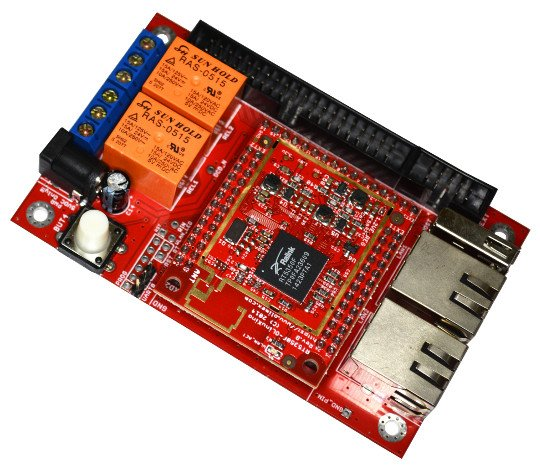

# RT5350F-OLinuXino-EVB

Open Source Hardware Embedded MIPS Linux Single Board Computer with RT5350F SoC 2.4Ghz WIFI 801.11n 150Mb x2 100Mb Ethernet ports Relays, Button

# Features

**Includes RT5350F-OLinuXino and extends the design with the following features:**

- [Barrel power jack for easier powering](https://www.olimex.com/wiki/PWRJACK) (5V only!)
- USB 2.0 type A connector
- 2 x 10/100 Mbps Ethernet ports with connectors
- UART connector pins at 0.1" step for easier serial debugging
- 2 x 10A/250VAC (15A/120VAC 15A/24VDC) relays with connectors and status LEDs
- User-programmable button
- [UEXT connector](https://www.olimex.com/Products/Modules/UEXT)
- JTAG pinholes exposed for chain programming
- EXT connector at 0.1" step with the unused RT5350 signals
- 27 GPIOs (24 free GPIOs)
- 4 grounded mounting holes
- Operating temperature: -10+55C
- Dimensions: (4000 x 2500)mils ~ (102 x 64)mm

**RT5350F-OLinuXino comes with the following features:**

- RT5350 SoC – Ralink’s IEEE 802.11n draft compliant 1T1R MAC/BBP/PA/RF; 360 MHz MIPS24KEc CPU core; a 5-port integrated 10/100 Ethernet switch/PHY and a USB
- 32MB SDRAM
- 8MB SPI NAND Flash
- On-board antenna
- WLAN activity LED
- Power LED
- x3 external connectors at convenient 0.1" step with all RT5350F signals
- x3 external DCDC power converters releasing internal RT5350F vreg and preventing common problem with overheating with this chip.
- Two mounting holes
- Suitable for embedding
- Operating temperature: -10+55C
- Size: (1600 x 1900)mils ~ (41 x 48)mm

# Documents

- [User's manual](doc/manuals/RTF5350F-OLinuXino-UM.pdf)
- [Wiki article (build instructions, software restore instructions, demo projects, etc)](https://www.olimex.com/wiki/RT5350F-OLinuXino)
- [Board pinout (top vew)](doc/rt5350f-olinuxino-evb-pinout.png)
- [Olimex product page](https://www.olimex.com/Products/OLinuXino/RT5350F/RT5350F-OLinuXino-EVB/open-source-hardware)

# Hardware

- [Source files](.)

# Software

- Preloaded OpenWRT with Linux Kernel 3.18.17

# Community

- [OLinuXino forum](https://www.olimex.com/forum) for discussion and community support
- [Freenode #olimex irc channel for OLinuXino development discussions](http://webchat.freenode.net/?channels=olimex)
- [Video that shows the first steps with RT5350F-OLinuXino-EVB by Leon Anavi](https://www.youtube.com/watch?v=-MsywWtN79c)

# FAQ

### I just received the product. How to establish basic connection with the board?

Connect USB<->serial cable between the UART0 pins of the board and your personal computer.
Open your favourite serial terminal software on the COM port, created by your USB<->serial cable.
The baud rate for the connection is 57600.
Power RT5350F-OLinuXino-EVB using the PWR barrel jack (5V DC only!).

### I see only 16MB RAM listed in OpenWRT! The board is supposed to have 32MB RAM! Did I get a defective board? What should I do in order to see 32MB RAM?

The board should be fine.
During the production tests the amount of RAM listed in OpenWRT gets verified by a technician.
Usually there are three ways to fix this issue:

1.Unpower the board.
Disconnect your serial cable from the board.
Power the board and wait 30 seconds then connect the serial cable.
The entire 32MB of RAM memory should be available now.
Some noisy serial cables might alter the levels of the board, which affects the bootstrap configuration.

2. Purchase a better USB <-> serial cable.
Our serial cables ([USB-SERIAL-CABLE-F](https://www.olimex.com/Products/Components/Cables/USB-Serial-Cable/USB-Serial-Cable-F)) should work fine.

3. Disconnect the power supply from the board.
Connect pin #27 from EXT4 connector to pin #3 of the same connector via a 1K resistor.
After the connection is established apply power to the board.
This forces a 32MB-only bootstrap configuration - this alteration just pulls up LINK2 (since LINK3 is already pulled-up).
Refer to the datasheet of RT5350 for more information.