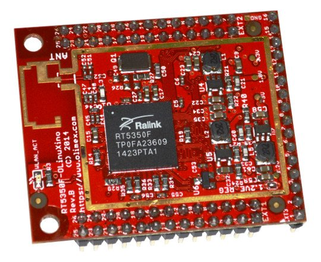

# RT5350F-OLinuXino

Open Source Hardware Embedded MIPS Linux Single Board Computer with RT5350F SoC 2.4Ghz WIFI 801.11n 150Mb x5 100Mb Ethernet port

# Features

- RT5350 SoC – Ralink’s IEEE 802.11n draft compliant 1T1R MAC/BBP/PA/RF; 360 MHz MIPS24KEc CPU core; a 5-port integrated 10/100 Ethernet switch/PHY and a USB
- 32MB SDRAM
- 8MB SPI NAND Flash
- On-board antenna
- WLAN activity LED
- Power LED
- x3 external connectors at convenient 0.1" step with all RT5350F signals
- x3 external DCDC power converters releasing internal RT5350F vreg and preventing common problem with overheating with this chip.
- Two mounting holes
- Suitable for embedding
- Operating temperature: -10+55C
- Size: (1600 x 1900)mils ~ (41 x 48)mm

# Documents

- [User's manual](doc/manuals/RTF5350F-OLinuXino-UM.pdf)
- [Wiki article (build instructions, software restore instructions, demo projects, etc)](https://www.olimex.com/wiki/RT5350F-OLinuXino)
- [Board pinout (top vew)](doc/rt5350f-olinuxino-pinout.png)
- [Olimex product page](https://www.olimex.com/Products/OLinuXino/RT5350F/RT5350F-OLinuXino/open-source-hardware)

# Hardware

- [Source files](.)

# Software

- Preloaded OpenWRT with Linux Kernel 3.18.17

# Community

- [OLinuXino forum](https://www.olimex.com/forum) for discussion and community support
- [Freenode #olimex irc channel for OLinuXino development discussions](http://webchat.freenode.net/?channels=olimex)