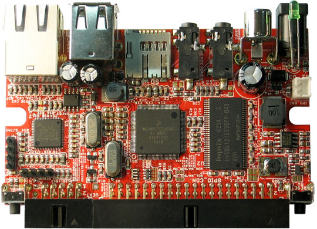

# iMX233-OLinuXino-MAXI

Open Source Hardware Embedded ARM Linux Single board computer with i.MX233 ARM926J @454Mhz

iMX233-OLinuXino is an industrial grade single-board Linux computer in a very compact form.

# Features

- iMX233 ARM926J processor at 454Mhz
- 64 MB RAM
- SD-card connector for booting the Linux image
- TV PAL/NTSC video output
- 2 USB High Speed Hosts
- Ethernet 100 Mbit
- Stereo Audio Input
- Stereo Headphones Audio Output
- Two buttons
- [UEXT connector](https://www.olimex.com/Products/Modules/UEXT) for connection of different peripherial modules
- 40 pin GPIO for connection of other hardware
- The board is shaped to fit inside a [Pactec JM42 plastic box](http://www.pactecenclosures.com/pdfs/drw_JM-42.pdf)
- Power supply input 6-16VDC
- PCB dimensions: 3.70'' x 2.15'' (94.0mm x 54.6mm)
- Nominal dimensions: 3.70'' x 2.65'' (94.0mm x 67.3mm)
- Operating temperature **0-70C** for iMX233-OLinuXino-MAXI
- Operating temperature **-45-85C** for iMX233-OLinuXino-MAXI+i

# Documents

- [User's manual](doc/manuals/iMX233-OLINUXINO-MAXI.pdf)

# Hardware

- [Source files](.)

# Software

- Image links, instructions, demo software, customer projects and more might be found at the [wiki page](https://www.olimex.com/wiki/IMX233)
- [MOD-TC-MK2 working with OLinuXino iMX233 with explanation](doc/MOD-TC-MK2_firmware_OLinuXino_v2.zip) also includes the new firmware of MOD-IO2]
- Open Embedded Linux Kernel with TV-console and peripherial support, instructions how to make a bootable SD-card [here](doc/OPEN-EMBEDDED-README.TXT)
- [Debian build instructions](doc/DEBIAN-BUILD.txt)
- [Bootable SD-card with Debian rootfs](doc/DEBIAN-README.TXT)
- [ARCH Linux build instructions](doc/ARCH-README.TXT)
- [How to build Linux Kernel with LTIB (obsolete)](doc/LTIB-README.TXT)
- [Open Embedded layer completed with support for iMX233-OLinuXino](https://github.com/Freescale/fsl-community-bsp-platform)
- Linux Kernel 3.X support work in progress
- [How to use a Wi-Fi dongle based on RealTek RTL8188CUS and RTL8192CU under ARCH Linux (thanks to Josh) v2](doc/Arch_Linux_wifi_setup.txt)
- [Android build on iMX233 instructions (in Spanish)](http://linuxencaja.net/wiki/Implementaci%C3%B3n_de_Android_en_procesador_i.MX233)
- [OpenOCD working script for iMX233](doc/SJTAG_TINY-H_imx233_openOCD.zip) - tested with OpenOCD 0.6.0, ARM-USB-TINY-H and iMX233-SJTAG
- [BitBurner software](doc/BitBurner.v1.0.4.6.zip) - software used for burning the iMX233 fuses
- [Emulation of OLinuXino](http://tech.groups.yahoo.com/group/olinuxino/message/631)

# Community

- [OLinuXino forum](https://www.olimex.com/forum) for discussion and community support
- [Freenode #olimex irc channel for OLinuXino development discussions](http://webchat.freenode.net/?channels=olimex)