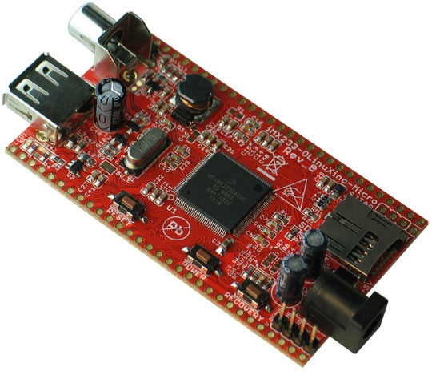

# iMX233-OLinuXino-MICRO

Open Source Hardware Embedded ARM Linux Single board computer with i.MX233 ARM926J @454Mhz

iMX233-OLinuXino-Micro is a single-board Linux computer in a very compact form.

# Features

- iMX233 ARM926J processor at 454Mhz
- 64 MB RAM
- SD-card connector for booting the Linux image
- TV PAL/NTSC video output
- 1 USB High Speed Host
- Three buttons
- 2x30 pin GPIO for connection of other hardware
- PCB dimensions: 3.00'' x 1.70'' (76.2mm x 43.2mm)
- Nominal dimensions: 3.40'' x 1.70'' (86.4mm x 43.2mm)

# Documents

- [User's manual](doc/manuals/iMX233-OLINUXINO-MICRO.pdf)

# Hardware

- [Source files](.)

# Software

- Image links, instructions, demo software, customer projects and more might be found at the [wiki page](https://www.olimex.com/wiki/IMX233)
- Open Embedded Linux Kernel with TV-console and peripherial support, instructions how to make a bootable SD-card [here](doc/OPEN-EMBEDDED-README.TXT)
- [Debian build instructions](doc/DEBIAN-BUILD.txt)
- [Bootable SD-card with Debian rootfs](doc/DEBIAN-README.TXT)
- [ARCH Linux build instructions](doc/ARCH-README.TXT)
- [How to build Linux Kernel with LTIB (obsolete)](doc/LTIB-README.TXT)
- [Open Embedded layer completed with support for iMX233-OLinuXino](https://github.com/Freescale/fsl-community-bsp-platform)
- Linux Kernel 3.X support work in progress
- [Android build on iMX233 instructions (in Spanish)](http://linuxencaja.net/wiki/Implementaci%C3%B3n_de_Android_en_procesador_i.MX233)
- [OpenOCD working script for iMX233](doc/SJTAG_TINY-H_imx233_openOCD.zip) - tested with OpenOCD 0.6.0, ARM-USB-TINY-H and iMX233-SJTAG
- [BitBurner software](doc/BitBurner.v1.0.4.6.zip) - software used for burning the iMX233 fuses
- [Emulation of OLinuXino](http://tech.groups.yahoo.com/group/olinuxino/message/631)

# Community

- [OLinuXino forum](https://www.olimex.com/forum) for discussion and community support
- [Freenode #olimex irc channel for OLinuXino development discussions](http://webchat.freenode.net/?channels=olimex)