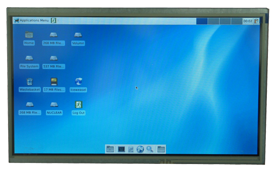

# A13-LCD10TS

10-INCH LCD DISPLAY WITH RESISTIVE TOUCHSCREEN PANEL SUITABLE FOR AND TESTED WITH ALLWINNER OLINUXINO BOARDS

**This item is OBSOLETE**

This product is replaced by [LCD-OLinuXino-10TS](../LCD-OLinuXino-10TS).

# Features

- 10" WSVGA (V:1024 lines, H:600 pixels) display
- LED light-bar backlight system (9 parallel 3 serial)
- 16 200 000 colors
- Resistive touch-screen panel
- Can be powered by the host board or externally
- DC-DC for LCD backlight
- 40 pin connector for direct connection to OLinuXino boards
- Testpads for easy diagnostic
- FR-4, 1.5 mm, red soldermask, component print
- Dimensions: 222 x 143mm (8.74 x 5.63")

# Documents

- [Display datasheet](doc/datasheets/F101TT50_1_release.pdf)

# Hardware

- [Schematic in PDF format](hardware/Rev.A/A13-LCD10TS_sch.pdf)
- [Schematic and board layout files for Eagle](hardware/Rev.A)

# FAQ

## Which boards can be used with A13-LCD10TS?

Olimex OLinuXino boards with proper 40-pin LCD connector (A20, LIME via adapter, etc).
The ten inch display is not recommended for A13 OLinuXino since it migth lack the computing power

## I bought A13-LCD10TS but when I connect it to the A20-OLinuXino I receive no image on the display. What do I do wrong?

The default A20-OLinuXino image is set for a HDMI display and 720p resolution.
To use LCD with A20-OLinuXino you need to set proper display settings.
An explanation of how to do it via the default script might be found in the [wiki article for A20-OLinuXino](https://www.olimex.com/wiki/A20-OLinuXino-MICRO).

## I bought an A13-LCD10TS and the SD card that has Linux image written on it. However the resolution I see on my VGA/LCD is not correct. What am I missing?

You would need to change the configuration file via the ``./change_display*`` script.
Detailed information may be found at the wiki article of your OLinuXino board.