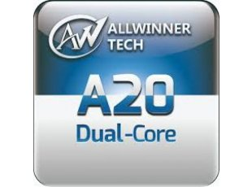

# A20-based boards

A20 is Dual Core Cortex-A7 device running at up to 1.2Ghz.

[Purchase an A20 open-source hardware board from Olimex](https://www.olimex.com/Products/OLinuXino/A20/open-source-hardware)